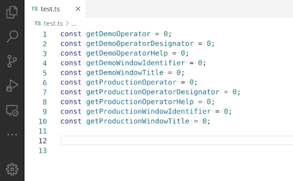

# Partial Autocomplete

This extension adds the ability to auto-complete by incremental steps. (Think bash auto-completion.)

## Troubleshooting

- My suggestions are not detected by Partial Autocomplete
    - See extension settings. Some languages (for example Lua) use `CompletionItemKind.Text` (plain text) for suggestions. `Text` suggestions are ignored with the default settings.

## Extension Settings

### Suggested Completions Settngs

- `partial-autocomplete.completionItemKind`: Specifies the `CompletionItemKind` to use for partial auto-completion. Affects the icon displayed next to the suggestion.
- `partial-autocomplete.completionItemSortString`: The sort string to use for partial completions.

### Scope Settings

- `partial-autocomplete.includeCompletionItemKindClass`: Include classes in partial auto-completion.
- `partial-autocomplete.includeCompletionItemKindColor`: Include colors in partial auto-completion.
- `partial-autocomplete.includeCompletionItemKindConstant`: Include constants in partial auto-completion.
- `partial-autocomplete.includeCompletionItemKindConstructor`: Include constructors in partial auto-completion.
- `partial-autocomplete.includeCompletionItemKindEnum`: Include enums in partial auto-completion.
- `partial-autocomplete.includeCompletionItemKindEnumMember`: Include enum members in partial auto-completion.
- `partial-autocomplete.includeCompletionItemKindEvent`: Include events in partial auto-completion.
- `partial-autocomplete.includeCompletionItemKindField`: Include fields in partial auto-completion.
- `partial-autocomplete.includeCompletionItemKindFile`: Include files in partial auto-completion.
- `partial-autocomplete.includeCompletionItemKindFolder`: Include folders in partial auto-completion.
- `partial-autocomplete.includeCompletionItemKindFunction`: Include functions in partial auto-completion.
- `partial-autocomplete.includeCompletionItemKindInterface`: Include interfaces in partial auto-completion.
- `partial-autocomplete.includeCompletionItemKindIssue`: Include issues in partial auto-completion.
- `partial-autocomplete.includeCompletionItemKindKeyword`: Include keywords in partial auto-completion.
- `partial-autocomplete.includeCompletionItemKindMethod`: Include methods in partial auto-completion.
- `partial-autocomplete.includeCompletionItemKindModule`: Include modules in partial auto-completion.
- `partial-autocomplete.includeCompletionItemKindOperator`: Include operators in partial auto-completion.
- `partial-autocomplete.includeCompletionItemKindProperty`: Include properties in partial auto-completion.
- `partial-autocomplete.includeCompletionItemKindReference`: Include references in partial auto-completion.
- `partial-autocomplete.includeCompletionItemKindSnippet`: Include snippets in partial auto-completion.
- `partial-autocomplete.includeCompletionItemKindStruct`: Include structs in partial auto-completion.
- `partial-autocomplete.includeCompletionItemKindText`: Include texts in partial auto-completion.
- `partial-autocomplete.includeCompletionItemKindTypeParameter`: Include type parameters in partial auto-completion.
- `partial-autocomplete.includeCompletionItemKindUnit`: Include units in partial auto-completion.
- `partial-autocomplete.includeCompletionItemKindUser`: Include user in partial auto-completion.
- `partial-autocomplete.includeCompletionItemKindValue`: Include values in partial auto-completion.
- `partial-autocomplete.includeCompletionItemKindVariable`: Include variables in partial auto-completion.

## Known Issues

- Some suggestions shown will not have parts suggested. This concerns auto-corrected suggestions (changed capital letters/unscrambled words/…).
    - The extension filters suggestions that start with the word before the cursor. This is to improve performance.
